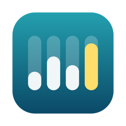
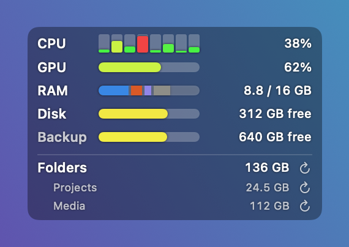
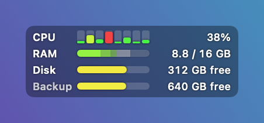
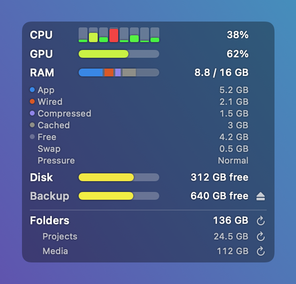
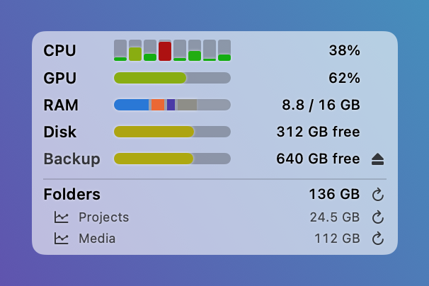

# SysPulse

[English](README.md) | **Русский**

Текущая версия: **0.3.2** — см. [Releases](../../releases) и [CHANGELOG](CHANGELOG.md).



Крошечная утилита для macOS, которая всегда показывает, **как себя чувствует компьютер прямо сейчас** — загрузку процессора по ядрам, оперативную память всех видов и свободное место на дисках, вживую в маленьком плавающем окошке и в меню-баре.

Сделана ради одной простой цели: держать машину в поле зрения, не открывая Мониторинг системы. Постоянный ответ перед глазами на вопрос «кто ест процессор / память / диск?» — поверх того, чем вы сейчас заняты.

## Как это выглядит

| Обычный режим | Компактный | Разбивка памяти | Контраст |
|:---:|:---:|:---:|:---:|
|  |  |  |  |

Полупрозрачное плавающее окошко поверх рабочего стола; те же цифры живут в меню-баре. Скриншоты рендерятся оффскрин с фейковыми данными скриптом `scripts/make-screenshots.sh` — реальное состояние машины не участвует.

## Возможности

- **Плавающее окошко** — небольшая полупрозрачная панель поверх всех окон, на всех десктопах, даже поверх полноэкранных приложений. Перетаскивается куда угодно, позиция запоминается.
- **Одно меню, два входа** — правый клик по окошку (или тап двумя пальцами) роняет прямо под ним то же меню, что и у значка в меню-баре. Ничего не спрятано в одном из двух, и всё остаётся под рукой, даже если на забитом меню-баре значок скрыт. Левая кнопка не занята ничем, кроме перетаскивания.
- **Процессор поядерно** — по столбику на каждое логическое ядро плюс общий процент. Столбики делят фиксированную ширину, поэтому окошко не «дышит» при скачках нагрузки.
- **Память всех видов** — составная полоска и «занято / всего» рядом: синий — приложения, оранжевый — резидентная, фиолетовый — сжатая, нейтральный серый — файловый кэш, а пустой хвост и есть свободная память. Цвет здесь говорит «что это», а не «сколько», и шаги проверены на различимость при дальтонизме и на контраст в обоих режимах. Включите разбивку — и все виды появятся цифрами, вместе с подкачкой и уровнем нагрузки на память по версии системы; наведение на метку ОЗУ показывает эту нагрузку в любой момент.
- **Подсказки при наведении** — наведите на сегмент полоски, и он назовёт себя и свой объём; наведите на строку разбивки — и она объяснит, что это за память и зачем она нужна, вплоть до того, что означают обычная, повышенная и критическая нагрузка. Пригодится, если вы когда-нибудь удивлялись, почему у здорового Mac почти нет свободной памяти.
- **Свободное место на дисках** — строка на каждый смонтированный локальный том: занятая доля полоской, свободное место цифрами; наведите на полоску — покажет занятое и полное имя тома — ровно то число, что показывает Finder (на APFS в него входит освобождаемое место снапшотов). Ненужные тома прячутся в настройках.
- **Размеры папок** — следите за любыми папками: добавьте их в разделе «Папки», задайте каждой периодичность обхода (не обновлять или от раза в минуту до раза в сутки) — и размеры встанут в панель отдельным блоком, под заголовком «Папки» с общей суммой по всем. Кнопка у заголовка пересканирует сразу все, у каждой папки есть своя. Задайте псевдоним, и в панели будет он вместо имени папки. Наведение показывает путь, режим обновления, время последнего обхода и десять самых крупных элементов внутри — подпапки и лежащие в корне файлы вперемешку, по убыванию размера, папки со слэшем на конце, — сразу видно, что именно съело место. Результат кэшируется, поэтому размер виден сразу после запуска, не дожидаясь нового обхода.
- **Цвет по нагрузке** — полоски идут от зелёного через жёлтый к красному по мере заполнения, так что загруженное ядро или забитый диск видно, не читая ни одной цифры.
- **Строка в меню-баре** — по умолчанию загрузка процессора, при желании ещё память и диск; цифры моноширинные, поэтому соседние значки меню-бара не дёргаются на каждом обновлении, а в подсказке значка всегда полная сводка. Выключите все три — вместо показаний появится маленькая иконка, так что меню не потеряется, даже если панель скрыта.
- **Частота обновления** — 0,5, 1, 2 или 5 секунд. Свободное место опрашивается отдельно и редко: меняется медленно, а стоит дороже.
- **Выбор метрик** — каждый блок (процессор, столбики по ядрам, память, разбивка, диски) включается отдельно; окошко ужимается ровно до оставленного.
- **Компактный режим** — ещё меньше: мельче шрифты, тоньше полоски, плотнее строки.
- **Бегунок непрозрачности** — один ползунок в настройках интерфейса ведёт окошко от полной прозрачности до плотно-чёрного; цвет текста подстраивается, чтобы оставаться читаемым.
- **Режим контраста** — переключатель в настройках интерфейса инвертирует гамму: фон уходит от прозрачного к белому, а текст — в противоположную сторону.
- **Выравнивание слева или справа** — при правом выравнивании строка зеркалится (значение, полоска, метка), а окошко держит правый край на месте и растёт влево. Удобно, когда окошко стоит у правого края экрана.
- **Поверх всех окон** — отдельный переключатель: если выключить, окошко ведёт себя как обычное и может уйти под другие.
- **Всё запоминается** — выбранные метрики, спрятанные тома, позиция окошка, компактный режим, выравнивание, непрозрачность и видимость переживают перезапуск.
- **Автозапуск** — переключатель в меню (через системный `SMAppService`).
- **10 языков** — English (по умолчанию), Русский, Español, Deutsch, Français, Italiano, Português, 中文, 日本語, 한국어. Переключаются из меню.

## Приватность

SysPulse не делает никаких сетевых запросов. Он читает счётчики только своей машины через публичные API macOS, а настройки хранит локально в собственных настройках приложения. Никаких аккаунтов, никакой аналитики, ничего не покидает ваш Mac.

## Установка (готовая сборка)

1. Скачайте `SysPulse.zip` со страницы [Releases](../../releases) и распакуйте.
2. Переместите `SysPulse.app` в `/Applications`.
3. Первый запуск: приложение не нотаризовано, поэтому обычный двойной клик macOS заблокирует. На **macOS 15 Sequoia** попробуйте открыть его, а затем зайдите в **Системные настройки → Конфиденциальность и безопасность** и нажмите **Открыть всё равно** — правый клик там больше не помогает, Apple убрала этот обход в Sequoia. На **macOS 13 и 14** правый клик по приложению → **Открыть** → **Открыть** ещё работает. В любой версии сработает снятие карантинного флага в Терминале:

   ```sh
   xattr -dr com.apple.quarantine /Applications/SysPulse.app
   ```

4. Показания появятся в меню-баре (если их не видно, меню-бар может быть переполнен — раздвиньте иконки перетаскиванием с Cmd). В любом случае при первом запуске появляется плавающее окошко, и правый клик по нему открывает то же меню.

Требуется macOS 13 Ventura или новее. Никаких особых разрешений не нужно.

## Сборка из исходников

Требуется: macOS 13+, Xcode Command Line Tools (`xcode-select --install`). Проект Xcode не нужен — это обычный Swift Package.

```sh
git clone https://github.com/igorpronin/SysPulse.git
cd SysPulse
./build-app.sh
ditto build/SysPulse.app /Applications/SysPulse.app
```

`build-app.sh` собирает release-бинарник через SwiftPM, заворачивает его в бандл `.app` с иконкой (её пересоздаёт `scripts/make-icon.sh`, если её нет) и подписывает ad-hoc. Версия берётся из `Sources/SysPulse/Version.swift` и показывается в окне «О программе».

Dev-вариант с дополнительной информацией в «О программе»: `./build-app.sh -dev`.

## Лицензия

MIT — см. [LICENSE](LICENSE).

## Как это устроено

- **Процессор** — `host_processor_info(PROCESSOR_CPU_LOAD_INFO)` отдаёт накопительные счётчики тиков по каждому логическому ядру; загрузка считается по разнице двух снимков (user + system + nice против общей суммы), поэтому первый снимок после запуска только задаёт точку отсчёта.
- **Память** — `host_statistics64(HOST_VM_INFO64)` в терминах Мониторинга системы: память приложений — анонимные страницы за вычетом purgeable, плюс резидентные (wired) и сжатые страницы; занято = приложения + резидентная + сжатая. Файловый кэш и свободная память идут отдельно, подкачка берётся из `vm.swapusage`, а уровень нагрузки — из `kern.memorystatus_vm_pressure_level`.
- **Диски** — `volumeAvailableCapacityForImportantUsage` по каждому смонтированному локальному видимому тому: ровно то, что показывает Finder.
- **Папки** — один обход дерева на сканирование: суммируется место, которое файлы реально занимают на диске (то же число, что у `du`), и попутно относится к той папке первого уровня, внутри которой файл лежит. Обходы идут по одному в фоне, не на главном потоке. Если добавить папку внутри «Рабочего стола», «Документов» или «Загрузок», macOS в первый раз спросит разрешение; папку, которую не прочитать, приложение так и покажет — «нет доступа», а не нулём. Память считается в двоичных гигабайтах, а диски — в десятичных, как это делает сама macOS.
- Окошко — безрамочная неактивирующаяся `NSPanel` на плавающем уровне с SwiftUI-вью внутри: клик по ней никогда не отбирает фокус у текущего приложения.
